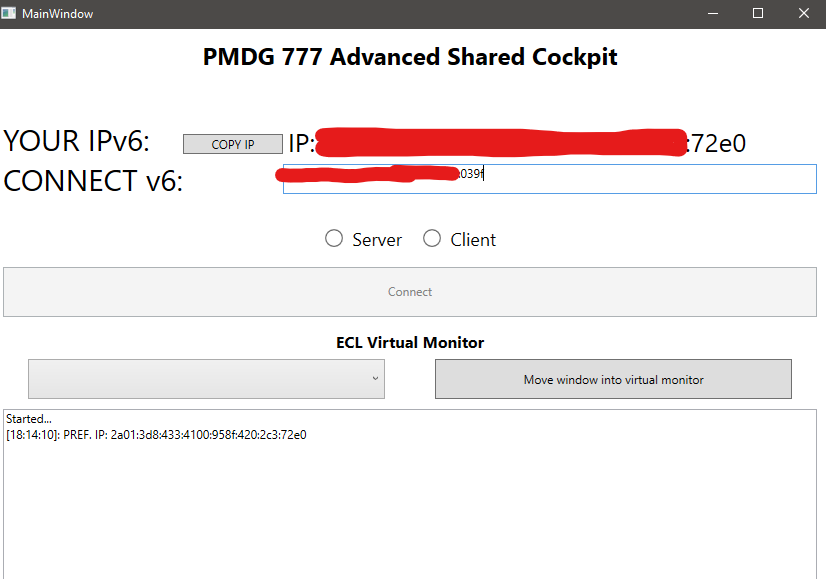
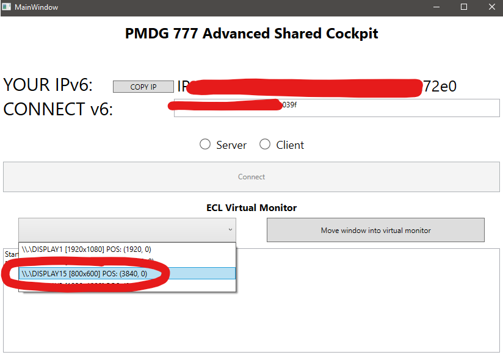
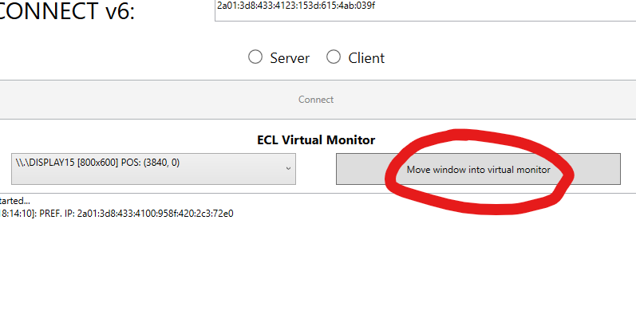

# Advanced-Shared-Cockpit-for-PMDG-777-and-MSFS2024

This tool extends and supports FS Copilot [website](https://fscopilot.com/) for a better PMDG 777 shared cockpit experience. It gives the opportunity to sync the Electronic Checklist Cursor by a quite big workaround. It uses an own developer IPv6 punching which only requires IPv6. No port forward or external server required! It is NOT an official PMDG product/service. All actions at your own risk!
Not tested for MSFS2020!

[RELEASES](https://github.com/Godehardt2003/Advanced-Shared-Cockpit-for-PMDG-777-and-MSFS2024/releases)

## What it does
1. ECL/Display cursor sync (done by a virtual display and image detection for cursor position)
2. State missmatch checks every 10 seconds. If parking brake, fuel control switches, APU, APU running, CDU L&R scratchpad inputs mismatch between both users a windows notification is displayed.

## Based on
1. [FS Copilot](https://fscopilot.com/)

## Enable PMDG SDK (required for CDU scratchpad checks)
1. Navigate to `C:\Users\xxx\AppData\Local\Packages\Microsoft.Limitless_8wekyb3d8bbwe\LocalState\WASM\MSFS2024\pmdg-aircraft-77f\work` (+ all different 777 variants)
2. Open 777_Options.ini
3. Add the following on the top of this file
```
[SDK]
EnableDataBroadcast=1
EnableCDUBroadcast.0=1
EnableCDUBroadcast.1=1

```

## Steps
1. Ensure that IPv6 is enabled on your computer. [test-ipv6](https://test-ipv6.com/). If ASC instantly closes after startup, IPv6 might not be enabled. To enable it in Windows, go to Control Panel -> Network and Internet -> Network and Sharing Center -> Change adapter settings -> Select your adapter -> Properties -> Enable "Internet protocol version 6 (TCP/IPv6)".

2. Install Virtual Display Driver and create a virtual display (800x600) https://github.com/VirtualDrivers/Virtual-Display-Driver

If you don't want a virtual display, you should be able to place the WASM Instruments window on a normal monitor. Of course you're not allowed to overlap it with any window then.
3. Both start PMDG 777 Advanced Shared Cockpit.exe.
4. PF enters the IPv6 from PM.

5. PM enters the IPv6 from PF.
6. Both popout their MSFS 777 lower EICAS cockpit display by pressing ALTGR and left click on the display (INSIDE THE SIMULATOR).
7. Both select their virtual monitor in the desired combobox.

8. Click "move window into virtual monitor". IMPORTANT: if you have different monitor sizes, you need to move the ASC Main Window INTO THE MONITOR WITH THE HIGHEST RESOLUTION BEFORE CLICKING "move windows into virtual monitor"!

9. The window should be disappeared now (its inside the virtual monitor)
10. PF selects "Server" and clicks connect
11. PM selects "Client", wait's 2-3 seconds and clicks connect
12. Connection should be established after some seconds. State checking only starts after pressing one CDU button on both CDUs (on both sides (PF/PM)) to fill the screen character buffer. For example you can simply press "RTE".


## In case of program restart!
If you restart ASC you have to press "move window into virtual monitor" then "get window back" then "move window into..." AGAIN!!! VERY IMPORTANT!

## Support
I'll give support on my PMDG 777 Weight And Balance Tool Discord Server which is another project by myself. Visit [https://skygroup-virtual.com/](https://skygroup-virtual.com/) and click on the Discord icon.

&copy; Tom Kadler
